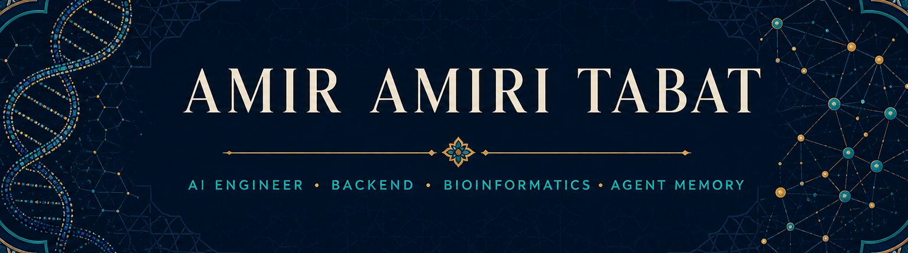

  

  
  
  

I'm an AI and backend engineer and a bioinformatics researcher based in İzmir. I enjoy the less glamorous parts of software—the data models, failure handling, pipelines, and tests that make a system dependable. My recent work has focused on multi-agent memory and single-cell RNA sequencing.

## What I'm working on

### Memory Universe

**[Memory Universe](https://github.com/MemoryUniverse/mu-core)** is a multi-user, multi-agent memory system. I started it because project knowledge is usually scattered across private chats, shared discussions, different teammates, and agents that cannot carry context between one another.

A Memory Universe workspace holds the durable memory of a project: decisions, tasks, evidence, constraints, artifacts, and the relationships between them. Inside that workspace, several people can work with their own agents in a shared session. The agents join under separate identities—one teammate may use Claude Code while another uses Codex—rather than acting through one shared account.

Shared work does not remove private work. Each person–agent pair can also have private sessions and private memory that stays local. A private session can use its own context together with shared context the user is allowed to see, without merging the private and shared stores.

Context can move between a private session, a shared session, and workspace memory as a selected packet—not as a dump of the full transcript. A transfer carries its source, purpose, permissions, and history; it can require approval, expire, or be revoked later. This lets one session pass its useful state and reasoning to another person or agent while keeping unrelated private context out of the handoff.

The local memory engine, capture client, and Python and TypeScript SDKs are built and being used with Claude Code and Codex. Shared multi-user sessions, governed context transitions, and the hosted coordination plane are the current private-beta work. Memory Universe also grew from my undergraduate research into long-horizon memory for agent systems.

### PeakATail

At **[BMGLab](https://github.com/BMGLab)**, I lead development of **[PeakATail](https://github.com/BMGLab/PeakATail)**, a Python package for studying alternative polyadenylation in single-cell RNA-seq data.

PeakATail starts from tagged BAM files produced by tools such as STARsolo and CellRanger. It calls poly(A) sites at read level, creates per-cell count matrices, clusters cells by their APA profiles, and supports differential APA testing, 3′ UTR length analysis, and cross-dataset cluster matching. The package is currently being benchmarked against reference poly(A) databases while we prepare the manuscript.

Alongside research code, I've worked on production backends, LLM routing and agent workflows, document-processing pipelines, real-time APIs, observability, and Linux infrastructure. I also led the IEEE Ege bioinformatics team and helped organize more than twelve technical workshops.

## Work beyond GitHub

Much of my professional work lives in private repositories, so the public projects only show part of what I have built.

- **LiboBerry — Backend & AI Developer:** I worked on research software with multi-provider LLM routing, LangGraph and Temporal workflows, MCP tools, OCR document processing, real-time chat, and an observability stack built around OpenTelemetry, Prometheus, Grafana, and Loki.
- **Genfoquest Analytica — Backend Developer & Bioinformatician:** I was the backend and DevOps engineer for SingleCellQuest, building FastAPI services, PostgreSQL and MongoDB storage, Docker deployments, and Nextflow pipelines for single-cell analysis.
- **SKY-MOD — Backend Engineering Intern:** I built the Mail domain of a multi-tenant Microsoft Graph service, including OAuth2, encrypted tenant credentials, Redis caching, failure handling, tests, and an MCP interface for agents.
- **BMGLab — Python Developer & Researcher:** In addition to PeakATail, I build single-cell workflows and help maintain the lab's Linux and Proxmox infrastructure.

## A few other projects

| | Project | Why it matters |
|:--:|---|---|
| 🔬 | **[Bioinformatics Tutorials](https://github.com/IEEE-Ege/BioinformaticTutorials)** | Makes foundational bioinformatics problems approachable through hands-on Python workshops. |
| 🛡️ | **[MCP Tool Poisoning Demo](https://github.com/TRextabat/valun_project)** | A small vulnerable/secure pair showing how poisoned tool descriptions can manipulate an agent. |
| 🔐 | **[Secure UDP Chat](https://github.com/TRextabat/net_sec)** | Combines authenticated messaging, Argon2id, rate limits, token revocation, and session expiry. |
| 📈 | **[LSTM Price Prediction](https://github.com/TRextabat/CIDL-Project1-LSTM-Price-Prediction)** | Compares four LSTM architectures with walk-forward validation and reproducible experiments. |

## Toolkit

  

**AI and agents:** PyTorch · LangGraph · Temporal · Model Context Protocol (MCP) · LiteLLM · PydanticAI · sentence-transformers · spaCy · RAG · multi-provider LLM routing

**Memory and retrieval:** Qdrant · FalkorDB · pgvector · Neo4j · Redis/Valkey · dense, sparse, and graph retrieval

**Backend and data:** FastAPI · Django · PostgreSQL · MongoDB · SQLAlchemy · Celery · REST · SSE · WebSockets · OAuth2 · Nextflow

**Infrastructure:** Docker · Kubernetes · OpenTelemetry · Prometheus · Grafana · Loki · CI/CD · Linux · Proxmox

**Bioinformatics:** Scanpy · AnnData · pysam · SAMtools · Bedtools · STAR · Pandas · SciPy · scikit-learn

## By the numbers

  
  

  
  

